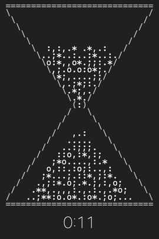
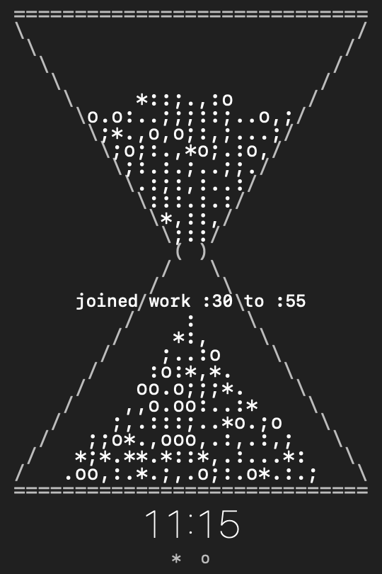

# TimeTurner

**A menu bar hourglass for the Mac. The sand drains over the current clock
hour, and at the top of every hour the glass turns itself over.**

<p align="center">

</p>

The whole thing is drawn out of keyboard characters. The frame is `=` `/`
`\` `(` `)`, the sand is `.` `:` `;` `,` `*` `o`, and every grain is real: a
falling-sand simulation drops them through the neck one at a time on the
actual clock, so the top bulb takes the full hour to empty. The demo above is
running at thirty-second hours; the real thing is slower and, honestly,
better company.

There are two views of the same hour:

- **The menu bar glass.** A tiny hourglass that visibly drains across the
  hour and does a smooth 180 degree turn at the top of it. Click it for how
  long until the next turn, Launch at Login, and the window.

  

- **The glass window.** Resizable; the glass reshapes itself to fit, and the
  sand physically tumbles into the new shape rather than teleporting. A thin
  countdown under the glass shows how much of the hour is left. Close it and
  the menu bar keeps the time alone.

## Pomodoro, with no start button

Nobody starts a pomodoro here. Turn on **Pomodoro Mode** and the hour
becomes the classic grid: 25 minutes of work, 5 of break, twice per hour,
turning at :00, :25, :30 and :55. Because 25 + 5 + 25 + 5 is exactly 60,
the grid anchors to the clock like everything else here. It runs whether
you are at your desk or not, and everyone running TimeTurner anywhere on
earth is in the same slot right now. There is no timer to set, no state to
lose, nothing to forget to start: you join the pomodoro already in
progress, the way you would join the hour.

The app says so, too. Flip the mode on and *joined work :30 to :55* floats
up under the neck of the glass and dissolves into the sand, and the window
title becomes the slot itself, so the timetable is always on display.

<p align="center">

</p>

Work runs the usual sand. Breaks run different sand, wavy `~` and `-`
grains, with a dimmed countdown and a lighter menu bar glass, so one glance
says which side of the cycle the world is on. Two small grains under the
countdown mark the hour's two pomodoros: done `*`, running `o`, still to
come `.`.

## Brown noise

**Brown Noise** in the menu plays a low, even rumble, generated live sample
by sample, no audio files. It is there for masking: it covers the room so
your head does not have to. And it follows the hour like everything else,
running full while the work sand falls and dropping to a whisper during
breaks, so you can hear which side of the pomodoro you are on with your
eyes closed. No claims about magic frequencies here; brown noise simply
keeps its energy down low, where it masks best and grates least over a
long session.

No dock icon, no settings beyond Launch at Login, Pomodoro Mode, and Brown
Noise. About 900 lines of Swift, no dependencies. Builds with the Xcode
Command Line Tools alone, so you do not need a 12 GB Xcode install to
compile it.

## Install

Download **TimeTurner.dmg** from [the latest release](https://github.com/apeabody007/timeturner/releases/latest),
open it, and drag TimeTurner to Applications. It is signed and notarized by
Apple, so it opens without any Gatekeeper warnings.

Or build it from a clone:

```
./build.sh install
```

That builds `TimeTurner.app`, copies it to `/Applications`, and launches it.
Turn on **Launch at Login** from the menu if you want it to always be there.
Note that a local build ad-hoc signs, so macOS may ask you to approve it the
first time.

## Watch it turn without waiting an hour

```
./build.sh
./build/TimeTurner.app/Contents/MacOS/TimeTurner --demo
```

Demo mode compresses the hour into thirty seconds, so you can watch the sand
drain and the glass turn over.

## How the sand works

- Every grain lives in a character grid and obeys falling-sand rules: fall
  straight down if you can, otherwise tumble diagonally. Piles come to rest
  at a 45 degree angle, which is why the bottom builds a cone.
- The neck is a gate wired to the clock. It releases grains only as the hour
  says they are due, so the drain is not an animation of an hour, it is one.
- Real sand keeps a level surface. In a wide window the funnel walls slope
  shallower than the grains can tumble, so a leveling pass flows the top
  chamber's high spots to its lowest hollows until the surface sits flat.
- Resizing carries the sand along: each grain remembers where it sat as a
  fraction of its chamber and is set back down as close to that spot as the
  new glass allows, then the simulation settles the rest.
- The state is derived from the current time, so the hourly turn, waking
  from sleep, and a resize can all reseat the glass and it is never wrong.

## License

MIT
